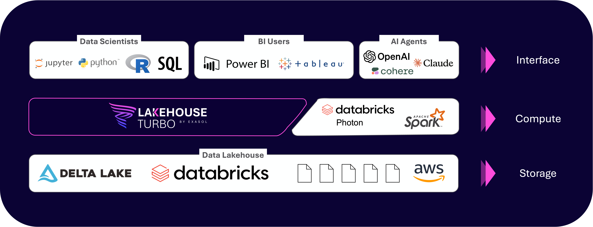

# Lakehouse Turbo Documentation

**Turbocharge Your Databricks Investment**

Lakehouse Turbo by [Exasol](https://www.exasol.com) supercharges Databricks analytics, delivering up to 182x faster query performance while enabling companies to save as much as 75% on compute costs. Seamlessly integrated with Unity Catalog, it empowers enterprises to scale analytics across more users and use cases—no ETL, data movement, or re-architecture required. Whether supporting BI, ad-hoc queries, or ML automation, Lakehouse Turbo ensures sub-second performance and effortless, self-tuning administration. As Databricks adoption grows, you can expand insights without facing runaway costs or performance bottlenecks. Empower your teams, maximize your Databricks investment, and unlock real business value with Lakehouse Turbo’s plug-and-play acceleration for enterprise analytics.

## How Lakehouse Turbo Works

Lakehouse Turbo connects to your catalog, scans metadata, and loads selected tables into our high-speed engine, automatically and incrementally. Once cached, data stays hot and ready for fast, concurrent queries, without touching your existing pipelines or storage layers.

**Proven Benefits of the plug-in Lakehouse Turbo Query Engine**

* No ETL, data movement or re-architecture
* Automatic, incremental updates to keep caches fresh
* Unity Catalog governance preserved end-to-end

## Continue Reading

* [Getting Started](getting-started.md)
* [Signup for free](https://www.lakehouseturbo.com)

