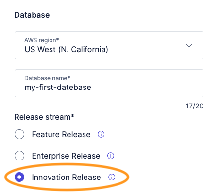
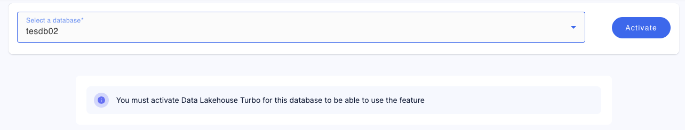
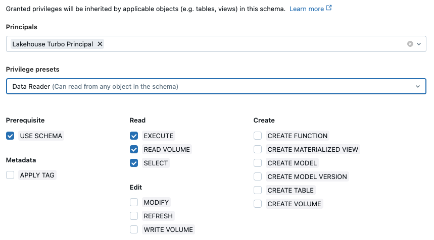

# Getting Started

## Step 1: Signup for Lakehouse Turbo

Lakehouse Turbo offers a free trial that is not limited in features and enables you to explore the full power of the plug-and-play query engine.

Required steps:

1. Signup for Lakehouse Turbo on [lakehouseturbo.com](https://www.lakehouseturbo.com)
2. Add a new database and select Release stream “Innovation Release”   
3. After the database has been created, activate Lakehouse Turbo by clicking “Lakehouse” in the left menubar, selecting the created database and click “Activate”   

## Step 2: Setup Databricks Workspace

Lakehouse Turbo requires read-only access to the metadata and the storage layer of the Data Lakehouse to be able to smartly mirror selected tables within Exasol.

Lakehouse Turbo needs read-only access to the following:

1. Databricks REST API via an OAuth Principal
2. Access to the underlying S3 bucket where the data is stored

### Create and configure an OAuth Principal

Required steps:

* Add a Service Principal to your account by [following the Databricks documentation](https://docs.databricks.com/aws/en/admin/users-groups/manage-service-principals#-add-service-principals-to-your-account)
* Add the Service Principal to your workspace by [following the Databricks documentation](https://docs.databricks.com/aws/en/admin/users-groups/manage-service-principals#assign-a-service-principal-to-a-workspace)
* Grant privileges to the Service Principal on those catalogs, schemas or tables that should be mirrored by Lakehouse Turbo
  * Recommended: select privilege preset “Data Reader”
  * or assign manually
    * Prerequisite: USE SCHEMA 
    * Read: EXECUTE
    * Read: READ VOLUME
    * Read: SELECT

**Example**

Principal “Lakehouse Turbo Principal” is given the privilege preset named "Data Reader" that contains all required privileges:

## Step 3: Setup and connect S3

Lakehouse Turbo requires read-only access to the S3 bucket that contains the storage layer of the Data Lakehouse. In order to get access, Lakehouse Turbo will assume an IAM role in your account. The following steps will guide you through 