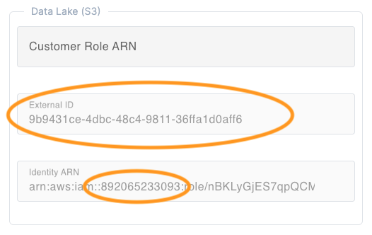

# Getting Started

Three steps are required to setup and configure Lakehouse Trubo by Exasol:

1. Signup for Lakehouse Turbo
2. Setup your Databricks Workspace
3. Setup and connect your S3 bucket

## Step 1: Signup for Lakehouse Turbo

Lakehouse Turbo offers a free trial that is not limited in features and enables you to explore the full power of the plug-and-play query engine.

Required steps:

1. Signup for Lakehouse Turbo on [lakehouseturbo.com](https://www.lakehouseturbo.com)
2. Add a new database and select Release stream “Innovation Release” <br /> 
3. After the database has been created, activate Lakehouse Turbo by clicking “Lakehouse” in the left menubar, selecting the created database and click “Activate” <br /> 

## Step 2: Setup Databricks Workspace

Lakehouse Turbo requires read-only access to the metadata and the storage layer of the Data Lakehouse to be able to smartly mirror selected tables within Exasol.

Lakehouse Turbo needs read-only access to the following:

1. Databricks REST API via an OAuth Principal
2. Access to the underlying S3 bucket where the data is stored

### Create and configure an OAuth Principal

Required steps:

* Add a Service Principal to your account by [following the Databricks documentation](https://docs.databricks.com/aws/en/admin/users-groups/manage-service-principals#-add-service-principals-to-your-account)
* Add the Service Principal to your workspace by [following the Databricks documentation](https://docs.databricks.com/aws/en/admin/users-groups/manage-service-principals#assign-a-service-principal-to-a-workspace)
* Grant privileges to the Service Principal on those catalogs, schemas or tables that should be mirrored by Lakehouse Turbo
  * Recommended: select privilege preset “Data Reader”
  * or assign manually
    * Prerequisite: USE SCHEMA 
    * Read: EXECUTE
    * Read: READ VOLUME
    * Read: SELECT

**Example**

Principal “Lakehouse Turbo Principal” is given the privilege preset named "Data Reader" that contains all required privileges:


## Step 3: Setup and connect your S3

Lakehouse Turbo requires read-only access to the S3 bucket that contains the storage layer of the Data Lakehouse. 
To get access, Lakehouse Turbo will transparently assume an IAM role in your AWS account.

**Get prerequisites**

You first need the __AWS account ID__ and the __External ID__ of your Lakehouse Turbo deployment: Navigate to "Lakehouse" in the menu, select your database and activate the Settings tab to copy both the __External ID__ and the __AWS Account ID__ as outlined in the screenshot below:


**Setup AWS role**

Login to the AWS that hosts the S3 bucket of the Data Lakehouse, open IAM and follow these steps:

* Login to the AWS account that hosts the S3 bucket of the Data Lakehouse
* Navigate to IAM and create a new role
* Choose "AWS account" as "Trusted entity type"
* Select "Another AWS Account" and enter the obtained __AWS Account ID__ from step "Get prerequisites"
* Choose option "Require External ID" and enter the __External ID__ from step "Get prerequisites"
* Add the permission policy "AmazonS3ReadOnlyAccess"
* And finally create the role

**Grant access to the role within S3**

Login to the AWS that hosts the S3 bucket of the Data Lakehouse, open S3 and follow these steps:

* Locate the S3 bucket of your Data Lake
* Click on the bucket name and navigate to tab "Permissions"
* Create the role and copy the ARN of the role
* Add the following statement to the Bucket policy:

```json
{
    "Sid": "Grant access for Data Lakehouse Turbo",
    "Effect": "Allow",
    "Principal": {
        "AWS": "${ROLE_ARN}"
    },
    "Action": [
        "s3:GetObject",
        "s3:ListBucket"
    ],
    "Resource": [
        "${BUCKET_ARN}/*",
        "${BUCKET_ARN}"
    ]
}
```
