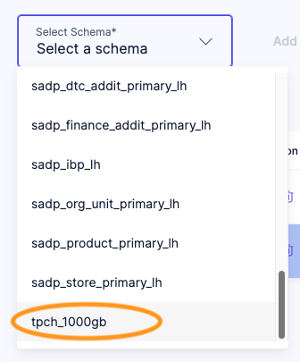
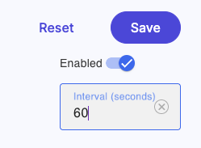
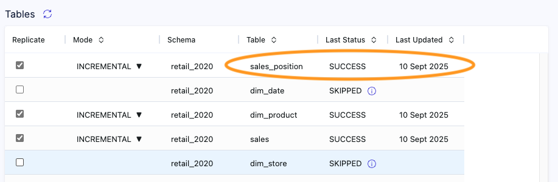

# Smart Caching

## Accelerate tables 

To accelerate queries in your Data Lakehouse, Lakehouse Turbo is smartly caching those tables. To accelerate required tables, follow these steps:

* Navigate to tab "Replication"
* Select the catalog and schema of the tables to accelerate <br /> 
* Click "Add" to add the schema to the list of accelerated schemas
* Select the schema to add or remove tables from the list of accelerated tables
* Tables that are checked will be accelerated

## Define the cache retention period

The retention period is defined on the schema level. It defines the interval of seconds between two cache invalidations. If, for example, the interval is set to 60 seconds, the cache will be invalidated every minute.



## Define the caching mode

The "Mode" defines the caching strategy. It can be defined on table level. The default is `INCREMENTAL`.

* `INCREMENTAL` - The table is cached incrementally, i.e. only new, updated or removed data since the load is cached.
* `FULL` - The table is truncated before caching. Afterwards, all available data is cached. Recommended for Data Marts that are overwritten on a regular basis.

## See the caching status

The caching status of each table can be found in the tabular overview on schema level. 

Additionally, Lakehouse Turbo keeps track of all caching activities in table `exa_dlhc.replication_log`. The following query shows the caching activities sorted by execution time descending:

```sql
select *
  from exa_dlhc.replication_log
 order by event_ts desc;
```